# Rice Info

- **WM**: Hyprland
- **OS**: Arch Linux
- **Terminal**: Kitty
- **Shell**: Zsh
- **Font**: JetBrainsMono Nerd Font
- **Theme**: Gruvbox-Material-Dark
- **Icons**: Gruvbox Plus Dark
- **Bar**: Waybar
- **Launcher**: Rofi
- **File Manager**: Thunar

desktop:
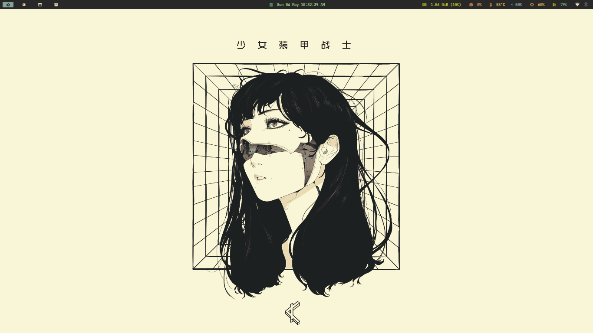

browser (firefox):
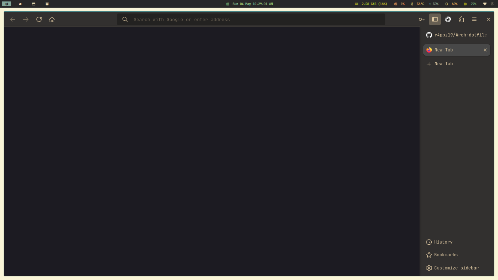

terminal (kitty + tmux):
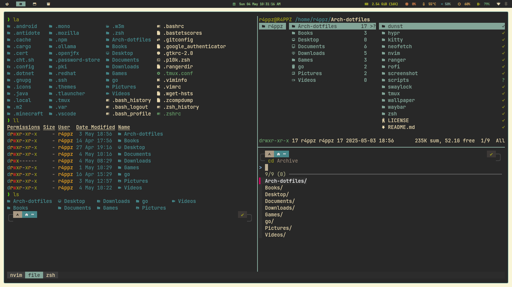

neovim :
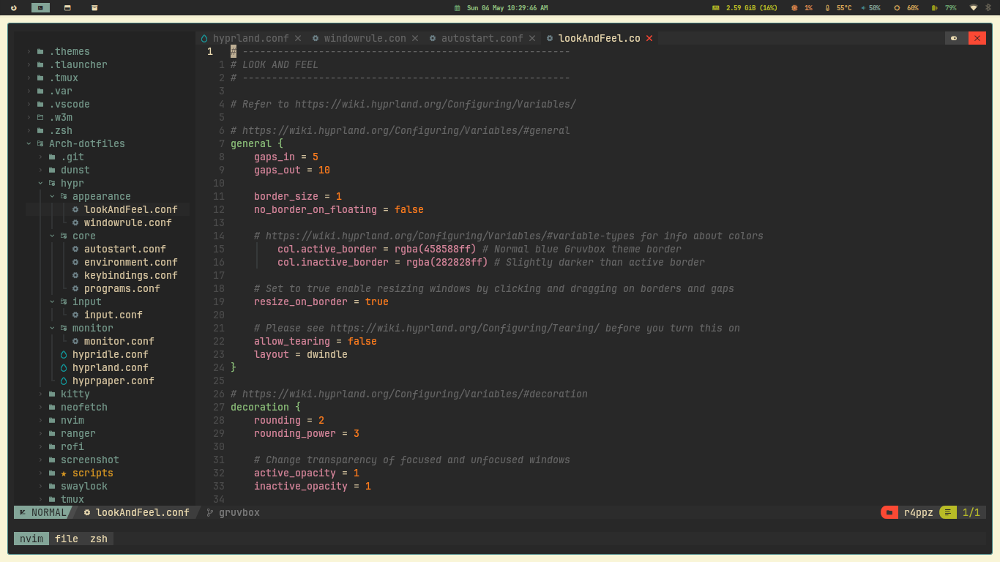

neofetch, fastfetch:
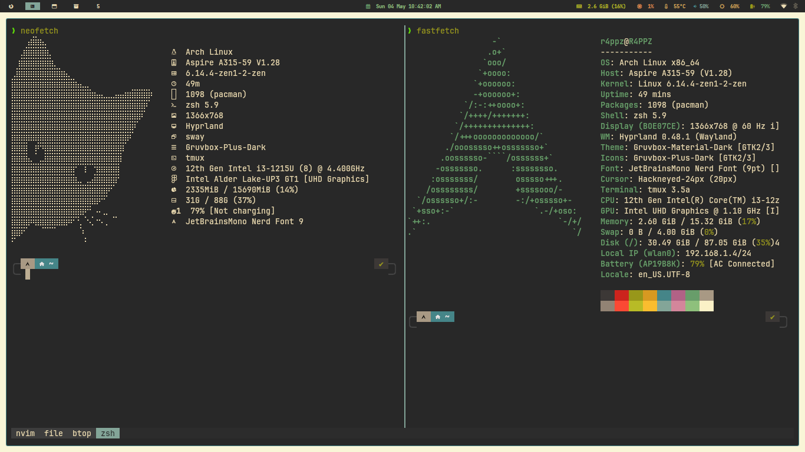

btop:
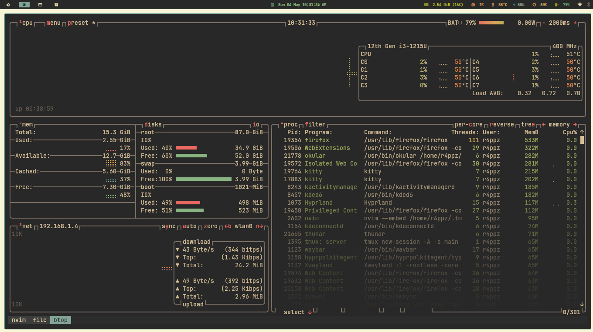

vscode:
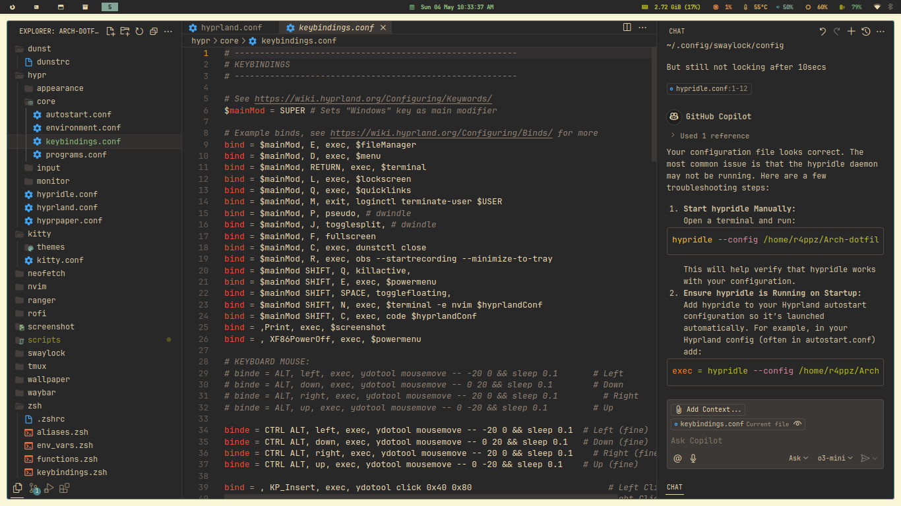

file manager (thunar):
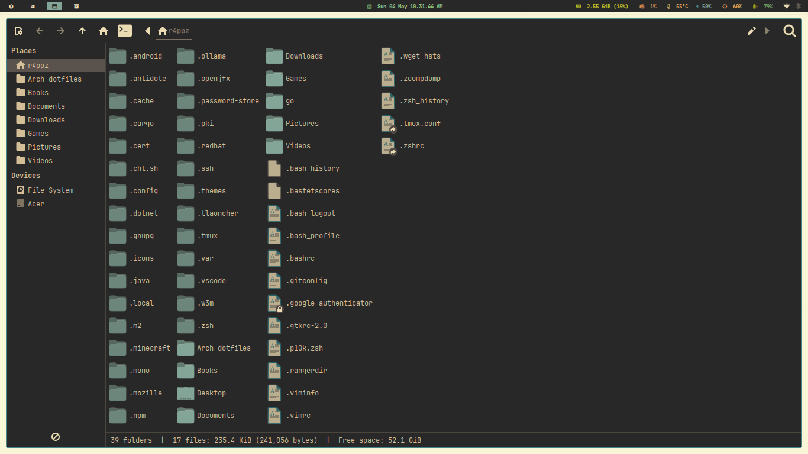

application launcher (rofi):
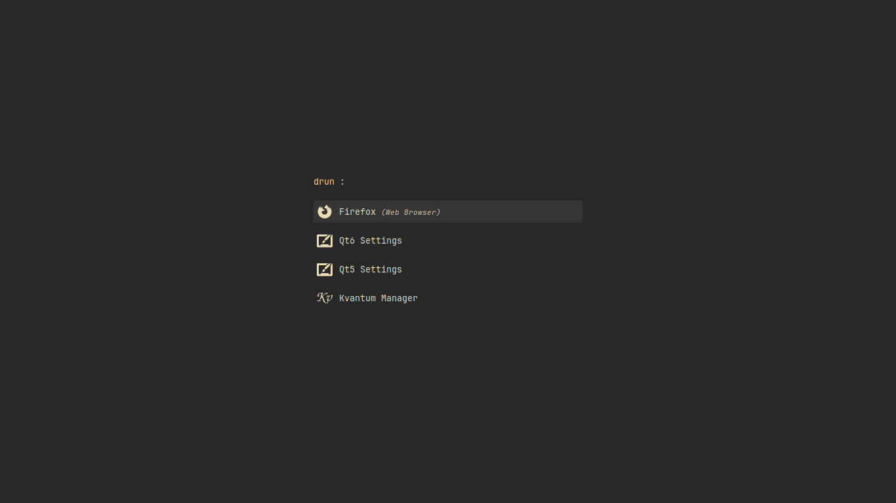

powermenu (rofi):
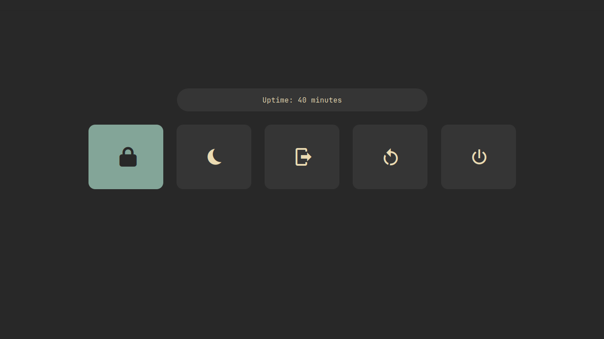

qt apps (kvantum, okular):
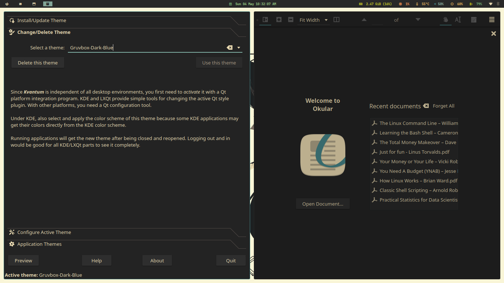